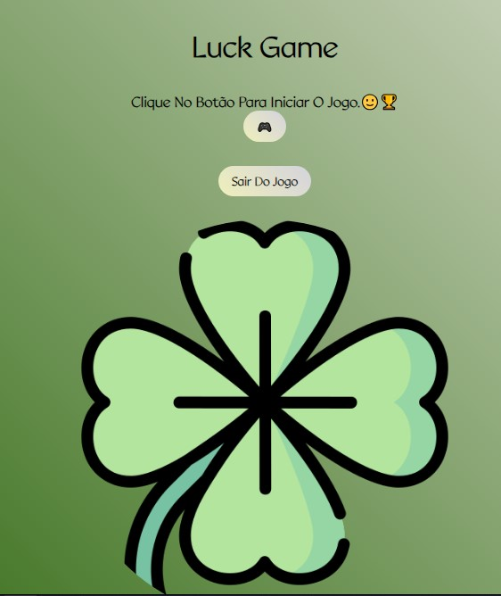
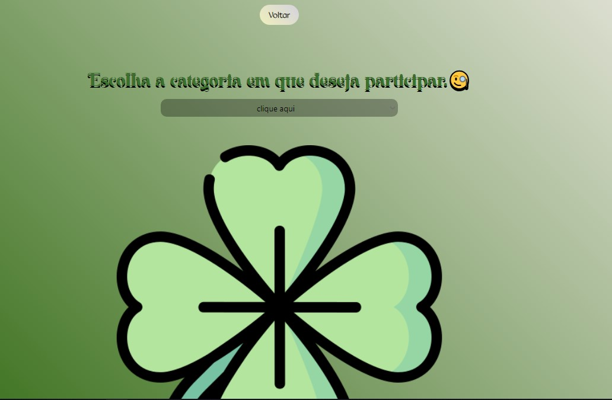
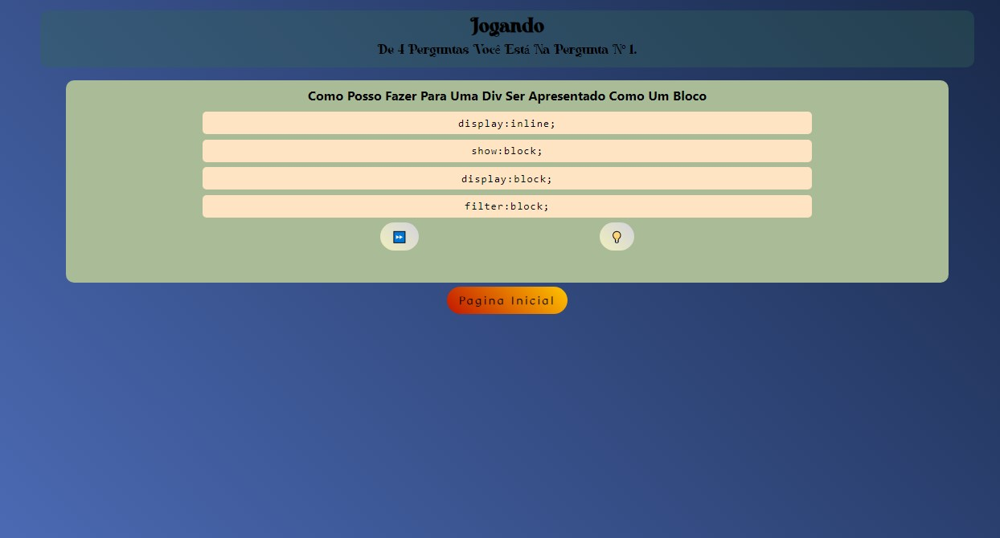
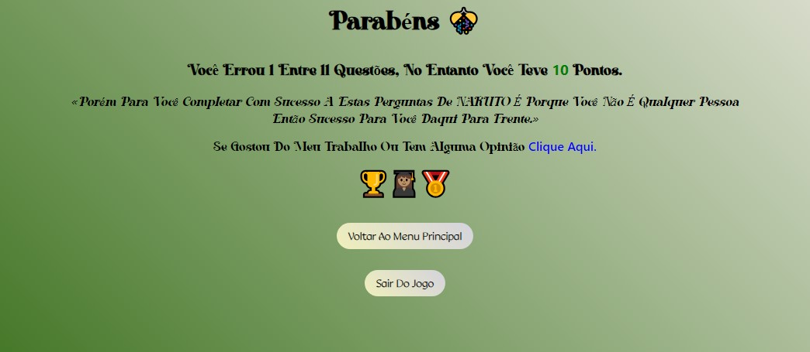

# __Luck Game__ ⭐⭐⭐⭐⭐

Luck Game é um jogo de perguntas, mas não é um qualquer.

Luck Game é um jogo moderno, completo e com estilo disponivel para todos os usuarios, ela dispõe uma iterface do usuario atrativa Feita 100% pelo DevCasi e 100% das pessoas que avaliaram este deram nota 5 ⭐⭐⭐⭐⭐.

 

## __Tela Inicial__
Abaixo verás a imagem da tela inicial *simples*, *linda* e coberta por uma junção de cores magnifica...✨🍀💚
 

## __Tela Para escolher a categoria de perguntas__
Clicando no botão de play você é direcionado para a tela abaixo onde você terá que escolher qual será o tipo das perguntas...✨🍀💚

## __Tela das Perguntas__
A parte mais esperada...✨🍀💚 
OBS: a cor muda a cada categoria escolhida.🌈

## __Tela das Perguntas__
E por fim e não menos importante temos a tela de Final, onde tú vez uma mensagem de parabéns e gratificação por teres jogado este jogo.✔🙏🌈💚🍀✨⭐
 

## __Fale Connosco__

    
Entre na nossa comunidade 
<a href='https://wa.me/244948409127?text=Ey+DevCasi,+gostei+do+seu+trabalho+aqui+no+Luck+Game.✔🐱‍👤🎲🎰🏆🔥' target="_blank">
                    *clicando aqui*.
</a>
Ou entre em contacto com o CEO da nossa compania
<a href='https://wa.me/244948409127?text=Ey+DevCasi,+gostei+do+seu+trabalho+aqui+no+Luck+Game.✔🐱‍👤🎲🎰🏆🔥' target="_blank">
                    *clicando aqui*.
</a>